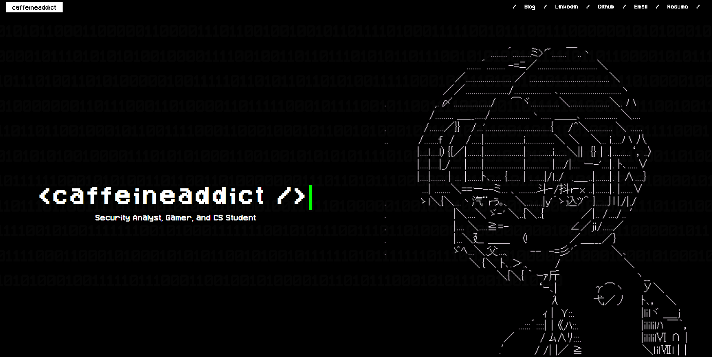
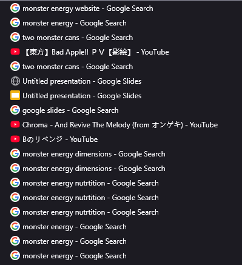

## introduction 
This post is actually two stories that became one. 

About 2-3 weeks ago, I had my first round of interviews with Cloudflare (which I'll now be interning at this summer!!). I'd been putting off properly deploying my portfolio since mid October last year (but localhost:4321 works on my computer..), and I wanted to actually understand Cloudflare's products before the interview. So I got the original site running with Cloudflare workers, got through the interview, and called it a day. 

Fast forward to this weekend. While my previous design wasn't bad, it was pretty generic. Out of the box Astro template with minimal customisation (pic of old site below!). While it worked, it didn't really represent me. I was also doomscrolling reels, and an idea just hit: What if I make a monster energy portfolio? Obviously. Why wouldn't I do that :3

What started as a "lock in before the interview" project turned into a caffeine fuelled weekend design overhaul two weeks later. The Cloudflare stuff and new design were separate projects that ended up in the same post because they're both part of the same website.

## so, what's the point?
This is my fourth attempt at making a website. My previous (3rd) portfolio used a really clean Astro Template (three cheers for Rei Ayanami!) It was great for getting something out fast when you have minimal frontend experience, but it still felt off? Like yes, it was technically *my* website, but it didn't really feel *like* me.

**Screenshot of my old site...**

I also had some mild paranoia about my site getting crawled or DDoS-ed, and I wanted proper security protection without spending actual money. WAF, DDoS mitigation, bot protection, etc. Cloudflare was an obvious answer.

Also, I didn't want to build from scratch. That sounded terrible. My second website used vanilla CSS/HTML/JS (made before generative AI was a thing) and it looked like a 1990s webpage. So my plan was: take what exists, make it more me, and deploy it properly this time.

## what i did
### moving to cloudflare + CI/CD
I built the site on Astro, but chose Cloudflare Workers as the hosting platform for the edge security benefits, and not just content delivery. I started on the default `workers.dev` domain, but migrated to a custom domain `hopelesscaffeineaddict.com` pretty quickly, as owning a zone allows you to unlock said edge protections, such as WAF rules, SSL/TLS controls, and Bot Fight Mode, which you don't get access to on the shared domain.

For deployment, I built a custom GitHub Actions CI/CD pipeline instead of using Cloudflare's native auto-deploy. On every push to main, it:
1. Checks out the code and installs dependencies
2. Runs TruffleHog to scan for accidentally committed secrets
3. Runs `npm run build` to produce the `dist/` folder
4. Runs `npx wrangler deploy` to push everything to Cloudflare

The setup involves a hybrid worker + assets deployment. `worker/index.js` is a custom fetch handler that intercepts every request, and this is where the security headers (CSP, HSTS) get injected. The built static assets in `dist/` are bound separately as `ASSETS` in `wrangler.toml` and served by the worker. While this is a bit more complex than a standard static deploy, it also means that security logic resides in the worker and automatically applies to every single response.

One annoying problem I ran into was API token scoping, as my first token was too restrictive (it was missing read permissions for user details), so deployments kept failing. After auditing the permissions, I scoped it correctly and stored it as a Github secret.

Once the pipeline was stable, I layered on defense in depth at the edge:
* CSP + HSTS headers to harden responses
* WAF custom rules to block malicious traffic before it reaches origin
* Rate limiting to stop layer 7 DDoS. Anything above 30 requests/10 secs gets a `429 Too Many Requests` and a timeout.
* Bot fight mode enabled, with explicit blocks on AI training crawlers

### the design (i am NOT a frontend developer)
For context: I have minimal frontend experience and zero 3D modelling/graphic design background. I also had very specific ideas.

The binary rain matrix had already been done, so it was easy enough to implement with CTRL+C and CTRL+V. 

As for the loading monster can animation, I had found a similar animation (coffee carafe being poured), and I threw that in Claude Code and asked it to change the dimensions to that of a Monster energy can pouring green liquid out, and slapped my SVG on it. 

On the other hand, the 3D interactive Monster can with my skills panel was really difficult. It required a very healthy dose of Claude and a lot of trial and error (fixing the lighting, ensuring text was not cut off).

I did extensive research on the monster energy for the 3D can: proportions, label design, colour values, the works. My search history is absolutely cooked. I also made my own SVG assets, imported the custom Monster Energy font as a TTF (then converted it), and effectively willed the can into existence through sheer persistence, caffeine, and Claude Code. 

**My search history from this Saturday**

### i see the light...? google indexing
Getting the site live is one thing. Getting it to actually appear in search results is another (still working on it!) I set up Google Search Console and manually submitted a sitemap to begin indexing. Without this step, Google might not crawl your site for weeks. Once submitted, you can monitor crawl status, spot any indexing errors, and see what search queries are pulling your site up.

## problems faced
* API token scoping: First token was too restrictive and my deployments failed silently. Always audit your token permissions before assuming your pipeline is broken
* CI/CD setup: Cloudflare's native auto-deploy doesn't give you enough control for hybrid worker/assets setups. I learned that building a custom github actions pipeline was more work upfront but worth it in the long run.
* Having no frontend skills whatsoever: I cannot stress this enough. more on this below

## what i've learned 
* **Least privilege is not just theory:** I quickly learned what "too restrictive" meant when my deployment broke and i had to trace the Github Action logs back to a token missing one read permission. Scoping API tokens correctly, storing them as secrets, and not hardcoding them anywhere is the kind of thing that sounds easy until you skip it and suffer.
* **AI-assisted development is legit**: I used Claude Code pretty heavily for the frontend work. However, I still had to validate what it created. I'd say it got about 90% of the way, and going into the respective files to tune specific parameters and understanding what the code was doing got it to about 100%. Knowing how to direct AI tooling, create clear and detailed prompts, validate its output, and filling in the gaps is extremely useful. Had I tried to do the frontend from scratch solo, this would've taken weeks (if it even got finished at all!)
* **Defense in depth at the edge is actually accessible**: WAF rules, rate limiting, honeypots, bot management. Cloudflare makes all of this configurable without needing to run your own infrastructure, and the barrier to a secure personal site is significantly lower than I had expected.
* **I do not ever want to do frontend:** However, I will make an exception for this website. Naturally, I will develop as a person, and when that time inevitably comes, I'll probably remake my website. 
* **monster energy please sponsor me.**